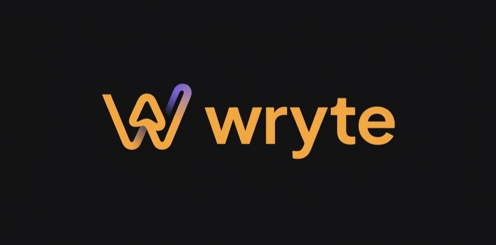

<p align="center">
  
</p>

<p align="center">
  <strong>Write Now, Publish Later</strong><br/>
  An editor-first content workflow tool for developers.
</p>

<p align="center">
  <a href="https://wryte.xyz">Website</a> &middot;
  <a href="https://wryte.xyz/how-it-works">How It Works</a> &middot;
  <a href="https://wryte.xyz/contact">Contact</a> &middot;
  <a href="CONTRIBUTING.md">Contributing</a>
</p>

<p align="center">
  
  
  
  
</p>

---

## What is Wryte?

Wryte is a writing workspace for developers who publish content to GitHub-backed blogs and sites. Capture rough ideas in a markdown editor, organize them on a kanban board, refine with AI, and publish as clean commits to any GitHub repo — on demand or on a schedule.

**No vendor lock-in.** You bring your own API keys (AI, media, GitHub). Wryte never proxies or stores your usage — keys are encrypted in WorkOS Vault and read per-request.

---

## Features

- **Markdown editor** — Distraction-free writing with live preview and syntax highlighting
- **Kanban board** — Organize articles across Draft, In Review, Scheduled, and Published columns
- **GitHub publishing** — One-click or scheduled publishing as clean commits to any repo/branch
- **AI assistance** — Schema-driven frontmatter suggestions, content refinement (Anthropic, OpenAI, OpenRouter — BYOK)
- **Media management** — Upload and manage images via Cloudinary or UploadThing
- **Multi-project workspaces** — Separate projects with independent settings, repos, and content
- **Calendar view** — Visualize your publishing schedule at a glance
- **Scheduling workflows** — Durable scheduled publishes with retries and conflict resolution
- **In-app support** — Built-in contact and ticket system

---

## Tech Stack

| Layer | Technology |
|-------|-----------|
| **Framework** | [Next.js 16](https://nextjs.org) (App Router, React 19) |
| **Backend** | [Convex](https://convex.dev) (real-time database, serverless functions, workflows) |
| **Auth** | [Clerk](https://clerk.com) |
| **Secrets** | [WorkOS Vault](https://workos.com) (encrypts user-supplied API keys) |
| **Styling** | [Tailwind CSS v4](https://tailwindcss.com), [Framer Motion](https://motion.dev) |
| **UI** | [Base UI](https://base-ui.com), shadcn-style components |
| **Lint / Format** | [Biome](https://biomejs.dev) |
| **Package Manager** | [Bun](https://bun.sh) |

---

## Getting Started

### Prerequisites

- [Bun](https://bun.sh) (package manager and runtime)
- [Convex](https://convex.dev) account and CLI
- [Clerk](https://clerk.com) application for authentication

### 1. Clone the repo

```bash
git clone https://github.com/rafay99-epic/wryte.xyz.git
cd wryte.xyz
```

### 2. Install dependencies

```bash
bun install
```

### 3. Configure environment variables

Copy the example env file and fill in your values:

```bash
cp .env.local.example .env.local
```

#### Next.js (`.env.local`)

| Variable | Description |
|----------|------------|
| `NEXT_PUBLIC_CONVEX_URL` | Convex deployment URL |
| `NEXT_PUBLIC_CLERK_PUBLISHABLE_KEY` | Clerk publishable key |
| `CLERK_SECRET_KEY` | Clerk secret key (server-side) |

#### Convex (set via `npx convex env set`)

| Variable | Description |
|----------|------------|
| `CLERK_JWT_ISSUER_DOMAIN` | Clerk JWT issuer domain for token verification |
| `CLERK_SECRET_KEY` | Same Clerk secret — used for GitHub OAuth token refresh |
| `WORKOS_API_KEY` | WorkOS Vault API key — encrypts user-supplied secrets |

> **Note:** AI provider keys (Anthropic / OpenAI / OpenRouter) and media keys (Cloudinary / UploadThing) are configured per-project by each user in **Project Settings**. They are never stored as env vars — they're encrypted in WorkOS Vault and read per-request.

### 4. Start the dev server

```bash
bun run dev
```

This runs Next.js and `convex dev` in parallel. The app is at [http://localhost:3000](http://localhost:3000).

---

## Scripts

| Command | Description |
|---------|------------|
| `bun run dev` | Next.js + Convex dev server (parallel) |
| `bun run dev:next` | Next.js only |
| `bun run dev:convex` | Convex dev only |
| `bun run build` | Production Next.js build |
| `bun run start` | Start production server |
| `bun run lint` | Biome check (lint + format consistency) |
| `bun run format` | Biome format with write |
| `bun run type` | TypeScript check (`tsc --noEmit`) |

---

## Project Structure

```
wryte.xyz/
├── convex/                 # Convex backend
│   ├── cms/                #   Content management (projects, documents)
│   ├── media/              #   Media uploads and management
│   ├── ai/                 #   AI provider integrations
│   ├── integrations/       #   GitHub, Clerk, secret store
│   ├── support/            #   Support ticket system
│   ├── account/            #   User settings and preferences
│   ├── _lib/               #   Shared utilities (auth, validation)
│   └── schema.ts           #   Database schema
├── src/
│   ├── app/                # Next.js App Router
│   │   ├── (marketing)/    #   Public pages (landing, how-it-works, contact)
│   │   └── (app)/          #   Authenticated app (dashboard, editor, projects)
│   ├── components/         # UI components
│   │   ├── ui/             #   Primitives (buttons, inputs, dialogs)
│   │   ├── layout/         #   Shell (sidebar, header, navigation)
│   │   └── providers/      #   Context providers (theme, Convex, toasts)
│   ├── features/           # Feature modules
│   ├── hooks/              # Reusable React hooks
│   ├── lib/                # Utilities (branding, SEO, colors)
│   └── stores/             # Zustand state stores
└── public/                 # Static assets
```

---

## CI

GitHub Actions (`.github/workflows/ci.yml`) runs on pushes and PRs to `main`:

1. Install dependencies (`bun install`)
2. Biome lint and format check
3. TypeScript type check
4. `bun audit` for dependency vulnerabilities
5. Production build (with placeholder env vars)

---

## Contributing

We welcome contributions! Please read the [Contributing Guide](CONTRIBUTING.md) before submitting a PR.

---

## License

This project is licensed under the [MIT License](LICENSE).

---

## Credits

Built by [Abdul Rafay](https://rafay99.com)

A product of [Syntax Lab Technology](https://syntaxlabtechnology.com)
